# Architecture

Companion to [project-charter.md](../project-charter.md). This is where the "how" lives: system flow, the math behind Screen/Monitor/Compare, and the security design that keeps personal data out of a public repo.

---

## 1. System flowchart

```mermaid
flowchart TD
    subgraph Sources["External Sources"]
        YF[Yahoo Finance<br/>prices + fundamentals]
        FRED[FRED API<br/>macro indicators]
        WIKI[S&P 500 constituent list<br/>GICS sector reference — ADR 0004]
    end

    subgraph PublicRepo["PUBLIC REPO — market-intelligence-platform"]
        ING[Python Ingestion<br/>GitHub Actions, daily]
        BRONZE[(Bronze — raw<br/>Supabase Postgres)]
        SILVER[(Silver — cleaned<br/>dbt staging/intermediate)]
        GOLD[(Gold — marts<br/>valuation-gap + anomaly scores)]
        REPO[Repository layer<br/>src/repositories]
        DOMAIN[Domain + scoring engine<br/>src/domain — pure, no I/O]
        SVC[Service layer<br/>src/services]
        API[FastAPI backend<br/>src/api — /screen /compare /score]
        APP[Streamlit App<br/>API client only, no DB access]
        TABLEAU[Tableau Public Dashboard]
    end

    subgraph PrivateRepo["PRIVATE — Noah's own infra, not in this repo"]
        WLDB[(Watchlist table<br/>tiny — ticker + last-seen score)]
        MONITOR[Watchlist Monitor job<br/>private scheduled Action]
        EMAIL[Private email alert]
    end

    YF --> ING
    FRED --> ING
    WIKI -.refreshed periodically, not daily.-> ING
    ING --> BRONZE --> SILVER --> GOLD
    GOLD --> REPO --> SVC
    DOMAIN --> SVC
    SVC --> API --> APP
    GOLD --> TABLEAU

    WLDB --> MONITOR
    MONITOR -->|HTTPS GET /score/ticker — public data only, no DB creds needed| API
    MONITOR -->|meaningful change detected| EMAIL

    style PrivateRepo fill:#2a2a2a,stroke:#888,stroke-dasharray: 5 5
    style WLDB fill:#552222
    style MONITOR fill:#552222
    style EMAIL fill:#552222
```



**Why Monitor is drawn outside the public repo:** the gold-layer marts (sector medians, valuation gaps) are public data derived from public S&P 500 filings — safe to publish. The moment a specific ticker gets tagged "Noah is watching this," that's personal information about his actual investment research, and it must never land in a public commit, a public GitHub Issue, or a public Actions log (public repos expose Action run logs to anyone). See [Section 4](#4-security--the-publicprivate-split) for the full reasoning.

**Why Monitor calls the API instead of the database directly:** this changed from the original design (see [ADR 0003](adr/0003-layered-architecture-and-api.md)). Monitor now only needs an HTTPS call to a public endpoint — it never touches Supabase credentials for market data at all. Its private secret surface shrinks to just email-sending credentials and its own tiny watchlist table. Less that could leak, because there's less private infrastructure to begin with.

---

## 2. Math methodology

**This section was hand-validated against real data before any code was written** — see [Section 2.6](#26-validation-against-real-data-phase-0) for what that check found and changed.

### 2.1 Sector-relative valuation gap (the Screen z-score)

Naive z-scores using mean/std break on valuation metrics because they're skewed and sometimes undefined (a company with negative earnings has no meaningful P/E). Use a **robust z-score** based on median and MAD (median absolute deviation) instead:

```
z(i, m) = (x(i, m) - median_s(m)) / (1.4826 * MAD_s(m))
```

- `i` = stock, `m` = metric (P/E, P/B, EV/EBITDA, P/S), `s` = the stock's GICS sector
- `MAD_s(m) = median(|x(j,m) - median_s(m)|)` over all stocks `j` in sector `s`
- `1.4826` scales MAD to be comparable to a standard deviation under a normal distribution, so `|z| > 2` means roughly the same thing it would with a conventional z-score
- If `x(i, m)` is undefined or negative in a way that makes the metric meaningless (e.g. negative P/E), that metric is excluded for that stock — never coerced to zero or dropped silently without a note in the output

**Composite valuation-gap score:** equal-weighted average of the available metric z-scores for that stock, **each first clipped (winsorized) to ±4** so one distorted metric can't single-handedly drive the composite:

```
z_clipped(i, m) = clip( z(i, m), -4, 4 )
composite(i)    = mean( z_clipped(i, m) for m in available_metrics(i) )
```

The clip was added after hand-validation (Section 2.6) showed AAPL's price-to-book z-score alone (~+8.5, from an asset-light balance sheet after years of buybacks — not really "expensive," just structurally low book equity) was enough to push its composite to +2.77 even though its P/E, EV/EBITDA, and P/S were unremarkable. Clipping caps any single metric's influence without excluding it entirely — the metric still counts, it just can't dominate. Metric weights beyond equal-weighting stay unconfigured at launch — no reason to guess at weights before there's evidence they matter.

Positive composite = trading rich vs. sector peers on average; negative = cheap vs. peers. This is descriptive, not a verdict.

### 2.2 Multivariate anomaly detection (isolation forest)

The z-score approach is per-metric and linear. Isolation Forest catches multivariate outliers a simple average might miss — e.g. a stock that's unremarkable on any single metric but unusual in combination.

- **Feature vector per stock**, standardized within its own sector: `[z_PE, z_PB, z_EV/EBITDA, z_PS, 30d_momentum, margin_trend, yoy_revenue_growth]`
- **Fit one Isolation Forest per sector** (cross-sector comparison isn't meaningful — a Utilities outlier and a Tech outlier aren't outliers for the same reason), `contamination=0.1` as the starting default (flags roughly the most unusual 10% per sector)
- Output: `anomaly_score(i)` — higher means more unusual vs. sector peers across the whole feature set, not just one metric

### 2.3 Shortlist rule (what actually surfaces in Screen)

A stock makes the shortlist if **either**:
- `|composite(i)| > 2.0` (robust z-score threshold), **or**
- `anomaly_score(i)` is in the sector's top decile

...**and** the output always reports which specific metric(s) drove the flag — this is Success Criterion #3 in the charter (interpretable results, not a black-box score). A flag with no traceable driver doesn't ship.

### 2.4 Watchlist change-detection (Monitor)

For each ticker on the private watchlist, recompute `composite(i)` daily and alert when **any** of:
- `|Δcomposite over trailing 5 trading days| > 1.0` — the valuation gap moved meaningfully in a week
- An earnings surprise exceeds a configurable threshold (needs an estimates data source — flagged as an open question, see [roadmap.md](roadmap.md) Phase 5)
- The stock's sector 20-day average return diverges from the S&P 500's by more than 1 standard deviation — sector rotation context, ties back to charter Objective 4

Thresholds are config, not hardcoded — they'll need tuning once there's real output to look at (see Risk: "composite score doesn't feel actionable" in the charter).

### 2.5 Compare

Pure query-time computation, no persistence: for 2–5 user-selected tickers, pull `composite(i)`, `anomaly_score(i)`, and the underlying metrics + their sector percentile rank, render side by side. Because it only ever touches tickers the user types in during that session, it's public-safe by construction — nothing here needs to be private.

### 2.6 Validation against real data (Phase 0)

Before writing any application code, the formulas above were run by hand against real `yfinance` data for 19 real S&P 500 tickers across three sectors (Information Technology, Health Care, Utilities). Script: [notebooks/phase0_validation.py](../notebooks/phase0_validation.py). Raw output: [docs/validation/](validation/) (constituent snapshot, raw sample, computed z-scores). Two things changed as a direct result:

1. **The composite score got a ±4 clip** (Section 2.1) after AAPL's inflated P/B alone produced an outsized composite despite unremarkable P/E/EV-EBITDA/P/S — see above.
2. **Sector classification source changed** — see [ADR 0004](adr/0004-sector-classification-source.md). `yfinance`'s own `sector` field only matched the official GICS sector name for 6 of 19 sampled tickers (32%) — it uses a coarser, differently-named taxonomy ("Technology" vs. GICS's "Information Technology," "Healthcare" vs. "Health Care"). Sector cohorts are the entire basis of the Screen z-score, so getting this wrong silently would have produced confidently-wrong output. Sector now comes from a dedicated reference table, not a per-ticker API field.

What held up without changes:
- **Excluding undefined metrics worked correctly** — ABBV's negative book value (-$74.70) correctly dropped out of its P/B z-score rather than producing a nonsense value.
- **Metric coverage was high enough to keep all four metrics**: in the sample, P/E and P/B were each ~95% usable, EV/EBITDA and P/S were 100% usable. No metric is thin enough to justify dropping from v1.

What's still a known limitation, not yet fixed: sector sample sizes in this validation were small (6–7 tickers per sector) purely because hand-checking 500 stocks isn't a Phase 0 activity. A sector's MAD computed from 6 stocks is noisier than one computed from the ~30–80 stocks each real GICS sector actually has (Utilities has 31, Information Technology has 73 per the Wikipedia constituent list) — the production numbers in Phase 3/5 will be more stable than this validation run's, not less.

---

## 3. Software architecture

Sections 1–2 describe *what* gets computed and *what flows where*. This section describes *how the code is structured* — because "an ML script in a dbt project with a dashboard reading the database directly" and "a properly layered service" produce the same numbers but are not the same engineering artifact, and per [ADR 0003](adr/0003-layered-architecture-and-api.md) this project is meant to demonstrate both data engineering and software engineering.

### 3.1 Layers

```
src/
  domain/          Pure business logic: dataclasses/Pydantic models (Stock, SectorCohort,
                    ValuationScore, AnomalyResult) and the ScoringEngine implementing the
                    math in Section 2. Zero I/O — no DB, no network, no filesystem. Fully
                    unit-testable with plain Python values in, plain Python values out.

  repositories/     Data access. An interface (e.g. MarketDataRepository) plus a Postgres/
                    Supabase implementation. Isolates SQL specifics from business logic;
                    swappable for an in-memory fake in unit tests.

  services/         Orchestration. ScreenService, CompareService — combine a repository
                    (get the data) with the domain engine (score it) into what the API
                    actually returns. No SQL here, no scoring math here — just wiring.

  api/              FastAPI app. Routers, Pydantic request/response schemas, dependency
                    injection for repositories/services. This is the only thing that
                    talks HTTP.

  ingestion/        Extract + load scripts (Bronze). A separate concern from the
                    application layers above — unchanged from the original scaffold.

  utils/            Shared helpers (DB connection, config loading).

dbt/                Silver/Gold SQL transforms — the repository layer reads from what
                    dbt produces here. dbt still owns bulk set-based transformation;
                    Python owns anything better expressed as an algorithm (the ML models,
                    the API).

tests/
  unit/             domain/ and services/, with repositories mocked or faked — no
                    network, no real database, fast and deterministic. This is where the
                    "hand-check the math" validation from Phase 0 becomes permanent: real
                    pinned input → expected z-score/anomaly output, not a one-time
                    spreadsheet check that gets thrown away.
  integration/      Repository implementations against a real (test) Postgres schema, and
                    API endpoints end-to-end via FastAPI's TestClient.

streamlit_app/      A thin client. Calls the FastAPI backend over HTTP. No direct database
                    access, no business logic — if the scoring math needs to change, it
                    changes in src/domain once, not in Streamlit and dbt and a notebook
                    separately.
```

### 3.2 Why layered instead of scripts + dashboard

- **Testability.** The scoring math is the highest-risk part of this project (charter risk: "composite score doesn't feel actionable"). Pure functions in `src/domain` can be pinned with real test cases and run in milliseconds in CI — no flaky network dependency, no test database needed just to check that a z-score formula is implemented correctly.
- **One implementation, several consumers.** Streamlit, Tableau (via the gold marts dbt produces), and the private Monitor job (via the API) all reach the same numbers through the same code path. There's no way for "the dashboard's math" and "the alert's math" to quietly drift apart, because there's only one math.
- **A smaller, safer private repo.** Monitor becomes an API client instead of a database client — see the note in Section 1. This is a direct consequence of this decision, not a separate one.
- **A demo-able backend, not just a dashboard.** FastAPI ships interactive API docs (`/docs`) for free. A hiring manager — or Noah, six months from now — can hit a live endpoint and read the schema, which is a distinct signal from "here's a Streamlit page."

### 3.3 Testing strategy

- **Unit tests** (`tests/unit/`): domain models and services, repositories mocked/faked. No I/O. This is the bulk of the suite and the fastest to run.
- **Integration tests** (`tests/integration/`): real repository implementations against a test schema, and API endpoints via `TestClient`. Fewer of these, run less often (not necessarily on every single local save, but always in CI).
- **Type hints throughout**, checked by `mypy` in CI alongside `ruff` (see `.github/workflows/ci.yml`).
- **Coverage tracked** via `pytest-cov`, reported but not gated at launch — a percentage target on day one with no code written yet just encourages testing trivial getters. Revisit once there's a real body of code to measure honestly.

### 3.4 API contract (sketch — will firm up in Phase 5/6, not final)

| Method | Path | Returns |
|---|---|---|
| `GET` | `/screen` | Ranked shortlist of sector-relative outliers (Screen) |
| `GET` | `/compare?tickers=AAPL,MSFT,...` | Side-by-side comparison for 2–5 tickers (Compare) |
| `GET` | `/score/{ticker}` | Latest composite score + anomaly score for one ticker — this is the endpoint the private Monitor job calls |

**Open question, deferred to Phase 6 (see [roadmap.md](roadmap.md)):** where the API is hosted. It needs to be reachable over HTTPS by the private repo's scheduled job, not just co-located with Streamlit. Render or Fly.io free tiers are the leading candidates — decide when Phase 6 starts, not now, since the answer doesn't change anything about the code.

---

## 4. Security — the public/private split

**Threat model, scoped honestly:** this isn't a multi-tenant system with other people's money or PII. The actual sensitive thing is narrow — *which tickers Noah is personally researching, and when he got alerted about them*. That's low-severity if leaked (not a password, not an SSN), but there's no reason to expose it either, and "no reason to expose it" is enough to keep it out of a public repo.

**The split:**

| | Public repo (this one) | Private (Noah's own infra) |
|---|---|---|
| Code | All of it — ingestion, dbt, ML, Streamlit, Tableau queries | None — imports/reuses the public code |
| Data | S&P 500 prices, fundamentals, macro indicators — all public information | Watchlist ticker list, alert history |
| Compute | GitHub Actions (public repo → logs are public) | A separate private GitHub repo's Actions (private repo → logs are private), or run locally |
| Alerting | Pipeline-failure alerts via public GitHub Issue (fine — "the ingestion job broke" has no personal content) | Watchlist-change alerts via **private email**, never a public issue or public log line |
| Secrets | Supabase creds, FRED key — GitHub Actions secrets, never committed | Its own tiny watchlist DB creds + email-sending creds only. **No Supabase market-data credentials at all** — Monitor reaches all market data through the public API (see [ADR 0003](adr/0003-layered-architecture-and-api.md)) |

**Why a separate private repo instead of one repo with mixed visibility:** GitHub repo visibility is all-or-nothing for Actions logs — there's no way to make one workflow's logs private while the rest of the repo stays public. Splitting into two repos is the simplest mechanism that actually enforces the boundary, rather than relying on discipline ("just don't log the ticker") which fails the first time someone forgets. See [ADR 0002](adr/0002-public-demo-vs-private-personal-data.md) for the full decision record.

**What stays true regardless of the split:**
- `.env` and all real credentials are gitignored — already true, unchanged
- The public repo's code is generic: it takes a ticker list as a parameter, it doesn't hardcode Noah's actual watchlist anywhere, ever
- Nothing in this project touches brokerage credentials, account numbers, or trade execution — that's permanently out of scope (charter Section 5)
