# Architecture

Companion to [project-charter.md](../project-charter.md). This is where the "how" lives: system flow, the math behind Screen/Monitor/Compare, and the security design that keeps personal data out of a public repo.

---

## 1. System flowchart

```mermaid
flowchart TD
    subgraph Sources["External Sources"]
        YF[Yahoo Finance]
        FRED[FRED API]
    end

    subgraph PublicRepo["PUBLIC REPO — market-intelligence-platform"]
        ING[Python Ingestion<br/>GitHub Actions, daily]
        BRONZE[(Bronze — raw<br/>Supabase Postgres)]
        SILVER[(Silver — cleaned<br/>dbt staging/intermediate)]
        GOLD[(Gold — marts<br/>valuation-gap + anomaly scores)]
        SCREEN[Screen engine<br/>z-score + isolation forest]
        COMPARE[Compare engine<br/>ad hoc, query-time only]
        APP[Public Streamlit App<br/>Screen + Compare tabs]
        TABLEAU[Tableau Public Dashboard]
    end

    subgraph PrivateRepo["PRIVATE — Noah's own infra, not in this repo"]
        WLDB[(Watchlist table<br/>private Supabase schema)]
        MONITOR[Watchlist Monitor job<br/>private scheduled Action]
        EMAIL[Private email alert]
    end

    YF --> ING
    FRED --> ING
    ING --> BRONZE --> SILVER --> GOLD
    GOLD --> SCREEN --> APP
    GOLD --> COMPARE --> APP
    GOLD --> TABLEAU

    GOLD -. read-only, generic query .-> MONITOR
    WLDB --> MONITOR
    MONITOR -->|meaningful change detected| EMAIL

    style PrivateRepo fill:#2a2a2a,stroke:#888,stroke-dasharray: 5 5
    style WLDB fill:#552222
    style MONITOR fill:#552222
    style EMAIL fill:#552222
```



**Why Monitor is drawn outside the public repo:** the gold-layer marts (sector medians, valuation gaps) are public data derived from public S&P 500 filings — safe to publish. The moment a specific ticker gets tagged "Noah is watching this," that's personal information about his actual investment research, and it must never land in a public commit, a public GitHub Issue, or a public Actions log (public repos expose Action run logs to anyone). See [Section 3](#3-security--the-publicprivate-split) for the full reasoning.

---

## 2. Math methodology

### 2.1 Sector-relative valuation gap (the Screen z-score)

Naive z-scores using mean/std break on valuation metrics because they're skewed and sometimes undefined (a company with negative earnings has no meaningful P/E). Use a **robust z-score** based on median and MAD (median absolute deviation) instead:

```
z(i, m) = (x(i, m) - median_s(m)) / (1.4826 * MAD_s(m))
```

- `i` = stock, `m` = metric (P/E, P/B, EV/EBITDA, P/S), `s` = the stock's GICS sector
- `MAD_s(m) = median(|x(j,m) - median_s(m)|)` over all stocks `j` in sector `s`
- `1.4826` scales MAD to be comparable to a standard deviation under a normal distribution, so `|z| > 2` means roughly the same thing it would with a conventional z-score
- If `x(i, m)` is undefined or negative in a way that makes the metric meaningless (e.g. negative P/E), that metric is excluded for that stock — never coerced to zero or dropped silently without a note in the output

**Composite valuation-gap score:** equal-weighted average of the available metric z-scores for that stock (configurable weights later, not at launch — no reason to guess at weights before there's evidence they matter):

```
composite(i) = mean( z(i, m) for m in available_metrics(i) )
```

Positive composite = trading rich vs. sector peers on average; negative = cheap vs. peers. This is descriptive, not a verdict.

### 2.2 Multivariate anomaly detection (isolation forest)

The z-score approach is per-metric and linear. Isolation Forest catches multivariate outliers a simple average might miss — e.g. a stock that's unremarkable on any single metric but unusual in combination.

- **Feature vector per stock**, standardized within its own sector: `[z_PE, z_PB, z_EV/EBITDA, z_PS, 30d_momentum, margin_trend, yoy_revenue_growth]`
- **Fit one Isolation Forest per sector** (cross-sector comparison isn't meaningful — a Utilities outlier and a Tech outlier aren't outliers for the same reason), `contamination=0.1` as the starting default (flags roughly the most unusual 10% per sector)
- Output: `anomaly_score(i)` — higher means more unusual vs. sector peers across the whole feature set, not just one metric

### 2.3 Shortlist rule (what actually surfaces in Screen)

A stock makes the shortlist if **either**:
- `|composite(i)| > 2.0` (robust z-score threshold), **or**
- `anomaly_score(i)` is in the sector's top decile

...**and** the output always reports which specific metric(s) drove the flag — this is Success Criterion #3 in the charter (interpretable results, not a black-box score). A flag with no traceable driver doesn't ship.

### 2.4 Watchlist change-detection (Monitor)

For each ticker on the private watchlist, recompute `composite(i)` daily and alert when **any** of:
- `|Δcomposite over trailing 5 trading days| > 1.0` — the valuation gap moved meaningfully in a week
- An earnings surprise exceeds a configurable threshold (needs an estimates data source — flagged as an open question, see [roadmap.md](roadmap.md) Phase 5)
- The stock's sector 20-day average return diverges from the S&P 500's by more than 1 standard deviation — sector rotation context, ties back to charter Objective 4

Thresholds are config, not hardcoded — they'll need tuning once there's real output to look at (see Risk: "composite score doesn't feel actionable" in the charter).

### 2.5 Compare

Pure query-time computation, no persistence: for 2–5 user-selected tickers, pull `composite(i)`, `anomaly_score(i)`, and the underlying metrics + their sector percentile rank, render side by side. Because it only ever touches tickers the user types in during that session, it's public-safe by construction — nothing here needs to be private.

---

## 3. Security — the public/private split

**Threat model, scoped honestly:** this isn't a multi-tenant system with other people's money or PII. The actual sensitive thing is narrow — *which tickers Noah is personally researching, and when he got alerted about them*. That's low-severity if leaked (not a password, not an SSN), but there's no reason to expose it either, and "no reason to expose it" is enough to keep it out of a public repo.

**The split:**

| | Public repo (this one) | Private (Noah's own infra) |
|---|---|---|
| Code | All of it — ingestion, dbt, ML, Streamlit, Tableau queries | None — imports/reuses the public code |
| Data | S&P 500 prices, fundamentals, macro indicators — all public information | Watchlist ticker list, alert history |
| Compute | GitHub Actions (public repo → logs are public) | A separate private GitHub repo's Actions (private repo → logs are private), or run locally |
| Alerting | Pipeline-failure alerts via public GitHub Issue (fine — "the ingestion job broke" has no personal content) | Watchlist-change alerts via **private email**, never a public issue or public log line |
| Secrets | Supabase creds for the public schema, FRED key — GitHub Actions secrets, never committed | Supabase creds for the private schema, email-sending creds — a *different* set of secrets, in the private repo |

**Why a separate private repo instead of one repo with mixed visibility:** GitHub repo visibility is all-or-nothing for Actions logs — there's no way to make one workflow's logs private while the rest of the repo stays public. Splitting into two repos is the simplest mechanism that actually enforces the boundary, rather than relying on discipline ("just don't log the ticker") which fails the first time someone forgets. See [ADR 0002](adr/0002-public-demo-vs-private-personal-data.md) for the full decision record.

**What stays true regardless of the split:**
- `.env` and all real credentials are gitignored — already true, unchanged
- The public repo's code is generic: it takes a ticker list as a parameter, it doesn't hardcode Noah's actual watchlist anywhere, ever
- Nothing in this project touches brokerage credentials, account numbers, or trade execution — that's permanently out of scope (charter Section 5)
